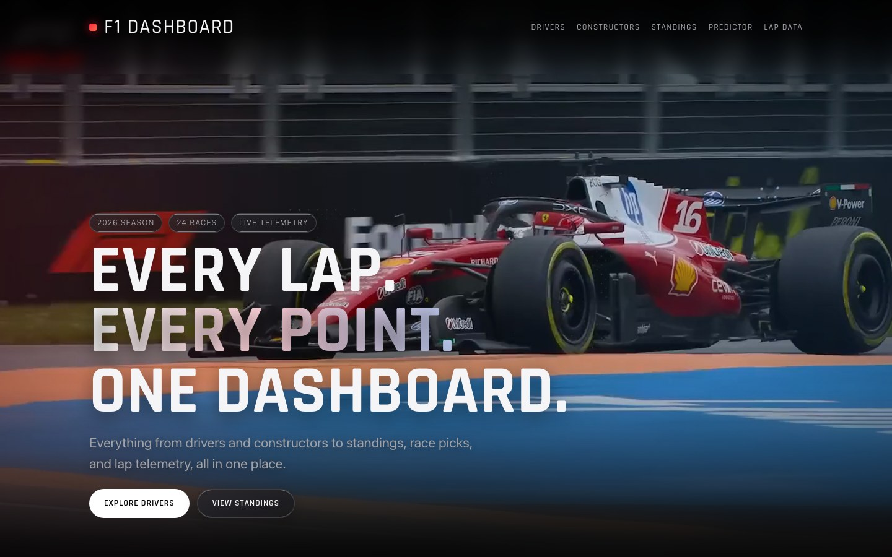
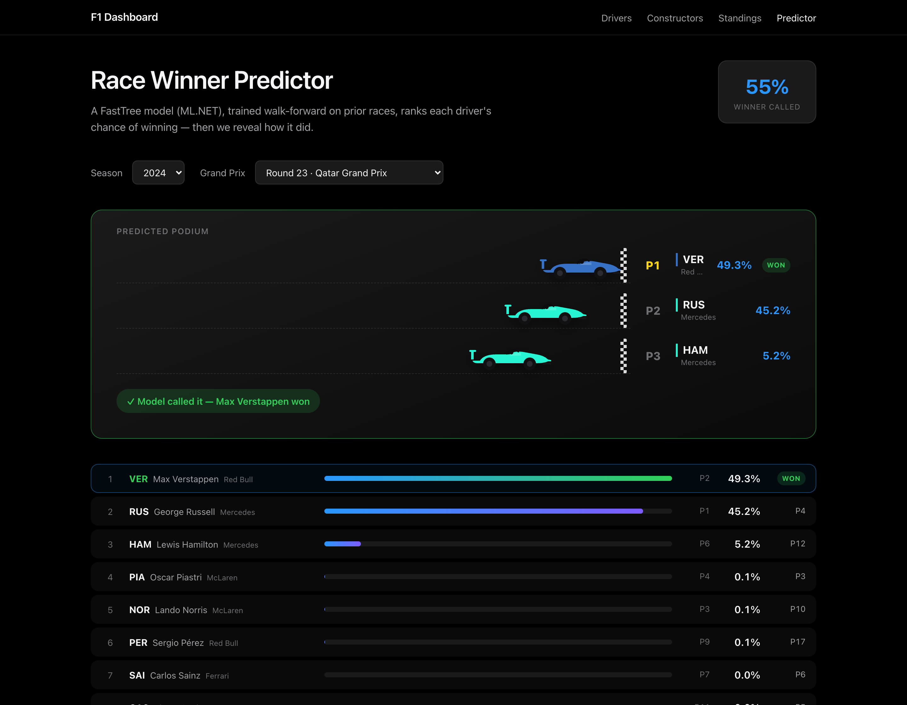
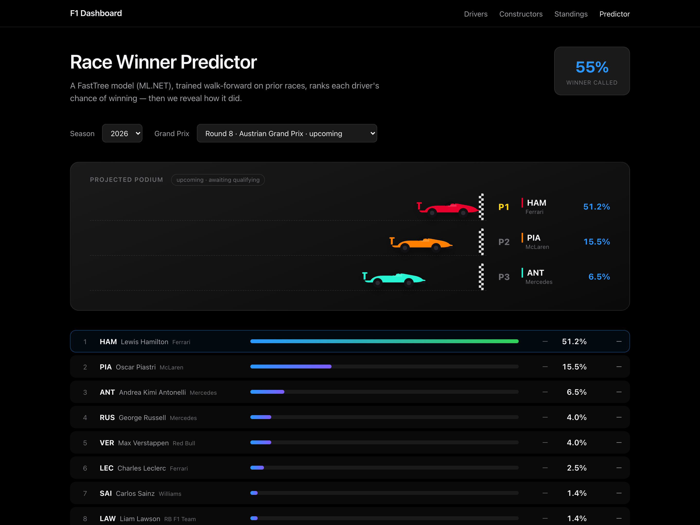
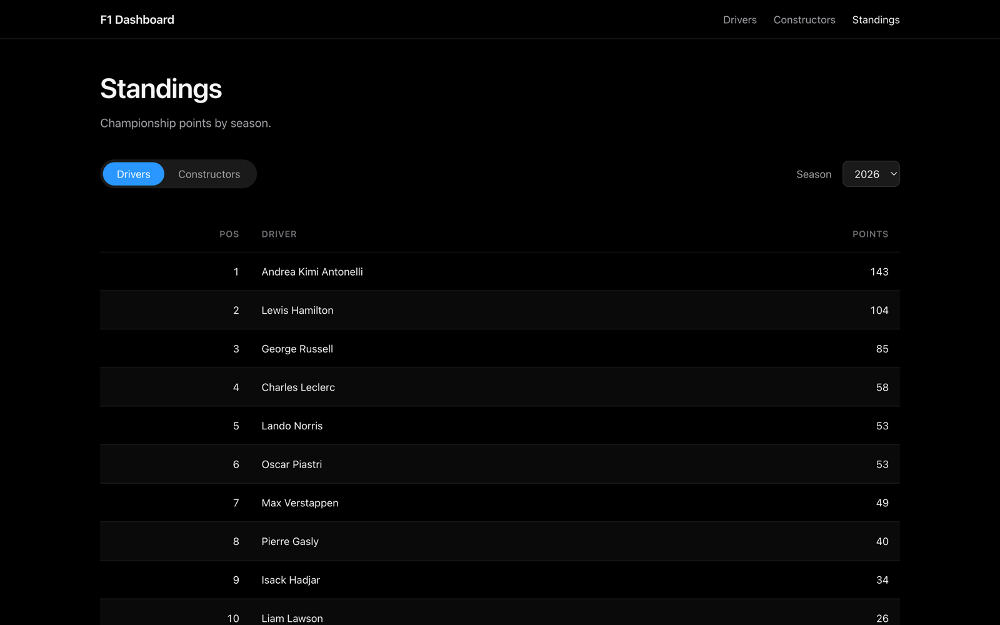
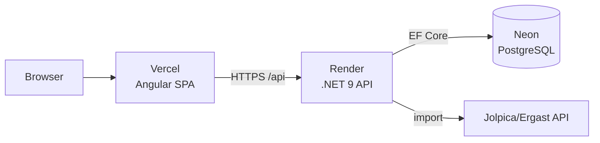

# F1 Dashboard

A full-stack Formula 1 analytics dashboard — browse drivers, constructors, and championship standings across the 2023–2026 seasons, plus a **machine-learning race-winner predictor**, fronted by an Apple-style landing page with a scroll-driven cinematic hero.

### ▶︎ Live demo: **[f1-dashboard-dusky-sigma.vercel.app](https://f1-dashboard-dusky-sigma.vercel.app)**

> Hosted on free tiers — the API may take ~30–60s to wake on the first request if it has been idle.





*Race winner predictor — for a completed race, the model's pick is graded against the real result (it called Qatar 2024 for Verstappen, who won).*



*Upcoming races have no qualifying yet, so a separate grid-free model projects the podium from current form.*



## Stack

- **Frontend:** Angular 19 — standalone components, the new `@if`/`@for` control flow, `inject()` DI. Deployed on **Vercel**.
- **Backend:** ASP.NET Core 9 Web API + Entity Framework Core 9 (`EFCore.NamingConventions` for snake_case), Scalar for OpenAPI. Containerized and deployed on **Render**.
- **Database:** PostgreSQL, hosted on **Neon**.
- **Machine learning:** an in-process [ML.NET](https://dotnet.microsoft.com/apps/machinelearning-ai/ml-dotnet) **FastTree** gradient-boosted classifier that predicts race winners — trained from the same Postgres data, no separate service to deploy.
- **Data:** real F1 results pulled from the public [Jolpica/Ergast API](https://api.jolpi.ca/) via a built-in importer.
- **Hero visual:** scroll-scrubbed real F1 track footage (Pexels, royalty-free) with a reduced-motion poster fallback. Re-download via `tools/fetch-hero-video.sh`.

## Architecture



## Features

- Apple-style landing page with scroll-scrubbed real F1 track footage and a reduced-motion poster fallback.
- Drivers and constructors listings.
- Driver **and** constructor championship standings with a season selector (2023–2026) and a Drivers/Constructors toggle.
- Standings computed server-side from race results (points aggregated per driver/constructor).
- **Race winner predictor (ML.NET):** ranks every driver's win probability for any Grand Prix and animates the projected podium as team-colored cars crossing the finish line. For past races it reveals a ✓/✗ verdict against the actual winner; **upcoming races are predicted too** with a separate, grid-free model over the current lineup.
- One-command data import that pulls real, current F1 data from a public API.

## API

Base URL (local dev): `http://localhost:5197`. Interactive docs (Scalar) at `/scalar/v1`.

| Method | Route | Description |
| ------ | ----- | ----------- |
| GET | `/api/drivers` | All drivers, ordered by last name |
| GET | `/api/drivers/{id}` | A single driver (`404` if not found) |
| GET | `/api/constructors` | All constructors, ordered by team name |
| GET | `/api/constructors/{id}` | A single constructor (`404` if not found) |
| GET | `/api/races?season={year}` | Races for a season (omit `season` for all), with circuit details |
| GET | `/api/races/{id}` | A single race with circuit details (`404` if not found) |
| GET | `/api/races/{id}/results` | Results for a race, with driver and constructor names, ordered by finish position |
| GET | `/api/standings/drivers/{season}` | Driver standings for a season (`404` if no results) |
| GET | `/api/standings/constructors/{season}` | Constructor standings for a season (`404` if no results) |
| GET | `/api/predictions/races/{season}` | Races available to predict for a season (completed **and** upcoming) |
| GET | `/api/predictions/race/{raceId}` | Ranked win probabilities for a race, with the actual result when known |
| POST | `/api/predictions/retrain` | Rebuilds the model from current data (Development / `AllowImport` only) |

## Race winner predictor

The **Predictor** tab estimates each driver's chance of winning a Grand Prix with a gradient-boosted classifier (ML.NET **FastTree**) trained in-process on the imported results — no separate Python service.

- **Honest, leak-free evaluation.** Completed races are scored *walk-forward*: each race is predicted by a model trained only on races that happened **before** it. The headline accuracy (~55% top-1) is the share of races whose actual winner was the model's highest-probability pick — a realistic figure for F1, where the favorite doesn't always win.
- **Features** (all computed strictly pre-race, so the model never sees the outcome it predicts): grid position, pole, driver & constructor recent form, season points pace, and circuit history.
- **Upcoming races** have no qualifying yet, so a second model trained **without** the grid features scores the current driver lineup — a deliberately less confident, form-based projection.
- **UI:** the projected podium animates as team-colored cars crossing the finish line; for past races each driver row reveals the real finishing position and a ✓/✗ verdict against the model's pick.

## Running locally

**Prerequisites:** .NET 9 SDK, Node 18+/20+, and a PostgreSQL instance.

**1. Backend** — set the connection string via [.NET user-secrets](https://learn.microsoft.com/aspnet/core/security/app-secrets) (never committed), then run:

```bash
cd src/F1Dashboard.Api
dotnet user-secrets set "ConnectionStrings:F1Database" "Host=localhost;Port=5432;Database=f1_dashboard;Username=postgres;Password=YOUR_PASSWORD"
dotnet run
```

The API creates its schema on first run. Load real data (defaults to seasons 2023–2026):

```bash
curl -X POST http://localhost:5197/api/import
```

**2. Frontend:**

```bash
cd src/F1Dashboard.Web
npm ci
npm start        # http://localhost:4200
```

The frontend reads its API base URL from `src/environments/` — `environment.development.ts` points at localhost; `environment.ts` holds the deployed backend URL.

## Deployment

Full Neon → Render → Vercel runbook in **[DEPLOYMENT.md](DEPLOYMENT.md)**.

## Project structure

```
f1-dashboard/
├── src/
│   ├── F1Dashboard.Api/   # ASP.NET Core 9 API (controllers, EF entities, DTOs, ML.NET predictor, Jolpica importer, Dockerfile)
│   └── F1Dashboard.Web/   # Angular 19 SPA (components, services, environments)
├── docs/                  # README screenshots
├── DEPLOYMENT.md          # hosting runbook
└── README.md
```
