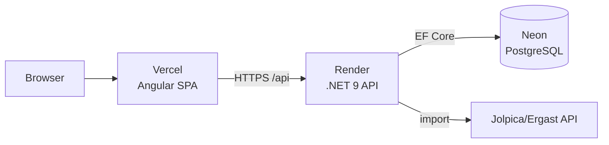

# F1 Dashboard

A full-stack Formula 1 analytics dashboard — browse drivers, constructors, and championship standings across the 2023–2026 seasons, fronted by an Apple-style landing page with a scroll-driven cinematic hero.

### ▶︎ Live demo: **[f1-dashboard-dusky-sigma.vercel.app](https://f1-dashboard-dusky-sigma.vercel.app)**

> Hosted on free tiers — the API may take ~30–60s to wake on the first request if it has been idle.


## Stack

- **Frontend:** Angular 19 — standalone components, the new `@if`/`@for` control flow, `inject()` DI. Deployed on **Vercel**.
- **Backend:** ASP.NET Core 9 Web API + Entity Framework Core 9 (`EFCore.NamingConventions` for snake_case), Scalar for OpenAPI. Containerized and deployed on **Render**.
- **Database:** PostgreSQL, hosted on **Neon**.
- **Data:** real F1 results pulled from the public [Jolpica/Ergast API](https://api.jolpi.ca/) via a built-in importer.
- **Hero visual:** a cinematic clip generated with [Higgsfield](https://higgsfield.ai), scroll-scrubbed (and replaced by a static poster under `prefers-reduced-motion`).

## Architecture



## Features

- Apple-style landing page with a scroll-driven hero video and reduced-motion fallback.
- Drivers and constructors listings.
- Driver **and** constructor championship standings with a season selector (2023–2026) and a Drivers/Constructors toggle.
- Standings computed server-side from race results (points aggregated per driver/constructor).
- One-command data import that pulls real, current F1 data from a public API.

## API

Base URL (local dev): `http://localhost:5197`. Interactive docs (Scalar) at `/scalar/v1`.

| Method | Route | Description |
| ------ | ----- | ----------- |
| GET | `/api/drivers` | All drivers, ordered by last name |
| GET | `/api/drivers/{id}` | A single driver (`404` if not found) |
| GET | `/api/constructors` | All constructors, ordered by team name |
| GET | `/api/constructors/{id}` | A single constructor (`404` if not found) |
| GET | `/api/races?season={year}` | Races for a season (omit `season` for all), with circuit details |
| GET | `/api/races/{id}` | A single race with circuit details (`404` if not found) |
| GET | `/api/races/{id}/results` | Results for a race, with driver and constructor names, ordered by finish position |
| GET | `/api/standings/drivers/{season}` | Driver standings for a season (`404` if no results) |
| GET | `/api/standings/constructors/{season}` | Constructor standings for a season (`404` if no results) |

## Running locally

**Prerequisites:** .NET 9 SDK, Node 18+/20+, and a PostgreSQL instance.

**1. Backend** — set the connection string via [.NET user-secrets](https://learn.microsoft.com/aspnet/core/security/app-secrets) (never committed), then run:

```bash
cd src/F1Dashboard.Api
dotnet user-secrets set "ConnectionStrings:F1Database" "Host=localhost;Port=5432;Database=f1_dashboard;Username=postgres;Password=YOUR_PASSWORD"
dotnet run
```

The API creates its schema on first run. Load real data (defaults to seasons 2023–2026):

```bash
curl -X POST http://localhost:5197/api/import
```

**2. Frontend:**

```bash
cd src/F1Dashboard.Web
npm ci
npm start        # http://localhost:4200
```

The frontend reads its API base URL from `src/environments/` — `environment.development.ts` points at localhost; `environment.ts` holds the deployed backend URL.

## Deployment

Full Neon → Render → Vercel runbook in **[DEPLOYMENT.md](DEPLOYMENT.md)**.

## Project structure

```
f1-dashboard/
├── src/
│   ├── F1Dashboard.Api/   # ASP.NET Core 9 API (controllers, EF entities, DTOs, Jolpica importer, Dockerfile)
│   └── F1Dashboard.Web/   # Angular 19 SPA (components, services, environments)
├── docs/                  # README screenshots
├── DEPLOYMENT.md          # hosting runbook
└── README.md
```
